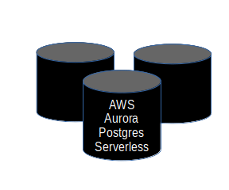

# aws-cloudformation-database-cluster

## Synopsis

The `aws-cloudformation-database-cluster` demonstrates a Senzing deployment using an AWS Cloudformation template.

## Overview

The `aws-cloudformation-database-cluster` demonstration is an AWS Cloudformation template that creates the following resources:

1. AWS infrastructure
    1. VPC
    1. Subnets
    1. Internet Gateway
    1. Routes
    1. IAM Roles and Policies
    1. Logging
1. AWS services
    1. AWS Relational Data Service (RDS) Aurora Postgres Serverless

The following diagram shows the relationship of the docker containers in this docker composition.
Arrows represent data flow.

GitHub repository for
[aws-cloudformation-database-cluster](https://github.com/Senzing/aws-cloudformation-database-cluster).

### Contents

1. [Preamble](#preamble)
    1. [Legend](#legend)
1. [Expectations](#expectations)
1. [Demonstrate using AWS Console](#demonstrate-using-aws-console)
1. [A Hack](#a-hack)
1. [Using deployment](#using-deployment)
1. [Additional topics](#additional-topics)
1. [Parameters](#parameters)
1. [Outputs](#outputs)

## Preamble

At [Senzing](http://senzing.com),
we strive to create GitHub documentation in a
"[don't make me think](https://github.com/Senzing/knowledge-base/blob/master/WHATIS/dont-make-me-think.md)" style.
For the most part, instructions are copy and paste.
Whenever thinking is needed, it's marked with a "thinking" icon :thinking:.
Whenever customization is needed, it's marked with a "pencil" icon :pencil2:.
If the instructions are not clear, please let us know by opening a new
[Documentation issue](https://github.com/Senzing/aws-cloudformation-database-cluster/issues/new?template=documentation_request.md)
describing where we can improve.   Now on with the show...

### Legend

1. :thinking: - A "thinker" icon means that a little extra thinking may be required.
   Perhaps there are some choices to be made.
   Perhaps it's an optional step.
1. :pencil2: - A "pencil" icon means that the instructions may need modification before performing.
1. :warning: - A "warning" icon means that something tricky is happening, so pay attention.

## Expectations

- **Space:** This repository and demonstration require 6 GB free disk space.
- **Time:** Budget 40 minutes to get the demonstration up-and-running.
- **Background knowledge:** This repository assumes a working knowledge of:
  - [AWS Cloudformation](https://github.com/Senzing/knowledge-base/blob/master/WHATIS/aws-cloudformation.md)

## Demonstrate using AWS Console

### Launch AWS Cloudformation

1. :warning: **Warning:** This Cloudformation deployment will accrue AWS costs.
   With appropriate permissions, the
   [AWS Cost Explorer](https://aws.amazon.com/aws-cost-management/aws-cost-explorer/)
   can help evaluate costs.
1. Visit [AWS Cloudformation with Senzing template](https://console.aws.amazon.com/cloudformation/home#/stacks/new?stackName=senzing-poc&templateURL=https://s3.amazonaws.com/public-read-access/aws-cloudformation-database-cluster/cloudformation.yaml)
1. At lower-right, click on "Next" button.
1. In **Specify stack details**
    1. In **Parameters**
        1. In **Security responsibility**
            1. Understand the nature of the security in the deployment.
            1. Once understood, enter "I AGREE".
        1. In **Senzing installation**
            1. Accept the End User License Agreement
        1. In **Security**
            1. Enter your email address.  Example: `me@example.com`
    1. Other parameters are optional.
       The default values are fine.
    1. At lower-right, click "Next" button.
1. In **Configure stack options**
    1. At lower-right, click "Next" button.
1. In **Review senzing-poc**
    1. Near the bottom, in **Capabilities**
        1. Check ":ballot_box_with_check: I acknowledge that AWS CloudFormation might create IAM resources."
    1. At lower-right, click "Create stack" button.

## A Hack

Unfortunately, the AWS Cloudformation template does not support a particular parameter for the AWS Aurora Postgres Serverless database
that is needed in this stack.
To work around this limitation, see
[How to set AWS RDS force-scaling-capacity](https://github.com/Senzing/knowledge-base/blob/master/HOWTO/set-aws-rds-force-scaling-capacity.md).
If possible, add a "thumbs up" to
[AWS Cloudformation issue #298](https://github.com/aws-cloudformation/aws-cloudformation-coverage-roadmap/issues/298)
to draw attention to this AWS Cloudformation defect.

## Using deployment

1. Visit [AWS CloudFormation console](https://console.aws.amazon.com/cloudformation/home).
    1. Make sure correct AWS region is selected.
1. Wait until "senzing-poc" status is `CREATE_COMPLETE`.
    1. Senzing formation takes about 20 minutes to fully deploy.
    1. May have to hit the refresh button a few times to get updated information.
1. Click on "senzing-poc" stack.
1. Click on "Outputs" tab.
1. Open the "0penFirst" value in a new web browser tab or window.
    1. Because this uses a self-signed certificate, a warning will come up in your browser.  Simply continue.
    1. In the "Sign in with your email and password" dialog box, enter the *UserName* and *UserInitPassword*
       values seen in the "Output" tab of the "senzing-poc" stack.  This is a one-time password.
    1. In **Change Password**, enter a new password.

## Additional topics

1. [How to load AWS Cloudformation queue](https://github.com/Senzing/knowledge-base/blob/master/HOWTO/load-aws-cloudformation-queue.md)
1. [How to set AWS RDS force-scaling-capacity](https://github.com/Senzing/knowledge-base/blob/master/HOWTO/set-aws-rds-force-scaling-capacity.md)
1. [How to migrate Senzing in AWS Cloudformation](https://github.com/Senzing/knowledge-base/blob/master/HOWTO/migrate-senzing-in-cloudformation.md)
1. [How to update Senzing license](https://github.com/Senzing/knowledge-base/blob/master/HOWTO/update-senzing-license.md)
1. [How to migrate an AWS RDS database](https://github.com/Senzing/knowledge-base/blob/master/HOWTO/migrate-aws-rds-database.md)

### Review AWS Cloudformation

The AWS resources created by the
[cloudformation.yaml](https://github.com/Senzing/aws-cloudformation-database-cluster/blob/main/cloudformation.yaml)
template can be see in the [AWS Management Console](https://console.aws.amazon.com).

1. CloudFormation
    1. [Stacks](https://console.aws.amazon.com/cloudformation/home?#/stacks)
1. CloudWatch
    1. [Log groups](https://console.aws.amazon.com/cloudwatch/home?#logsV2:log-groups)
1. Elastic Compute Cloud (EC2)
    1. [Load Balancers](https://console.aws.amazon.com/ec2/v2/home?#LoadBalancers:)
    1. [Network interfaces](https://console.aws.amazon.com/ec2/v2/home?#NIC)
    1. [Target groups](https://console.aws.amazon.com/ec2/v2/home?#TargetGroups:)
1. Identity and Access Management (IAM)
    1. Certificates
    1. [Policies](https://console.aws.amazon.com/iam/home?#/policies)
    1. [Roles](https://console.aws.amazon.com/iam/home?#/roles)
1. Relational Data Service (RDS)
    1. [Databases](https://console.aws.amazon.com/rds/home?#databases:)
    1. [Parameter groups](https://console.aws.amazon.com/rds/home?#parameter-groups:)
    1. [Subnet groups](https://console.aws.amazon.com/rds/home?#db-subnet-groups-list:)
1. Virtual Private Cloud (VPC)
    1. [Elastic IP addresses](https://console.aws.amazon.com/vpc/home?#Addresses:)
    1. [Endpoints](https://console.aws.amazon.com/vpc/home?#Endpoints:)
    1. [Internet gateways](https://console.aws.amazon.com/vpc/home?#igws)
    1. [NAT gateways](https://console.aws.amazon.com/vpc/home?#NatGateways:)
    1. [Network ACLs](https://console.aws.amazon.com/vpc/home?#acls)
    1. [Route Tables](https://console.aws.amazon.com/vpc/home?#RouteTables)
    1. [Security Groups](https://console.aws.amazon.com/vpc/home?#SecurityGroups)
    1. [Subnets](https://console.aws.amazon.com/vpc/home?#subnets)
    1. [VPCs](https://console.aws.amazon.com/vpc/home?#vpcs)

### View results

1. Visit [AWS Cloudformation console](https://console.aws.amazon.com/cloudformation/home).
1. Choose appropriate "Stack name"
1. Choose "Outputs" tab.
    1. For descriptions of outputs, click on the value for `ADescriptionOfOutputs`,
       which links to [Outputs](#outputs) further down this page.

## Parameters

Technical information on AWS Cloudformation parameters can be seen at
[Parameters](https://docs.aws.amazon.com/AWSCloudFormation/latest/UserGuide/parameters-section-structure.html).

### SecurityResponsibility

1. **Synopsis:**
   The Senzing proof-of-concept AWS Cloudformation uses
   [AWS Cognito](https://aws.amazon.com/cognito/) for authentication,
   and HTTPS (using a self-signed certificate) for encrypted network traffic
   to expose services through a single, internet-facing AWS Elastic Load Balancer.
   With exception of the
   [senzing/sshd](https://github.com/Senzing/docker-sshd) container,
   no tasks in the AWS Elastic Container Service (ECS) have public IP addresses.

   To enable additional security measures for the deployment in your specific environment,
   you'll need to consult with your AWS administrator.
1. **Required:** Yes
1. **Type:** String
1. **Allowed values:**
    1. "I AGREE"
1. **Default:** None

## Outputs

### DatabaseHostCore

1. **Synopsis:**
   One of 3 Senzing database servers that hold the Senzing Model.
1. **Details:**
   More information at [AWS RDS Console](https://console.aws.amazon.com/rds/home).

### DatabaseHostLibfeat

1. **Synopsis:**
   Two of 3 Senzing database servers that hold the Senzing Model.
1. **Details:**
   More information at [AWS RDS Console](https://console.aws.amazon.com/rds/home)

### DatabaseHostRes

1. **Synopsis:**
   Three of 3 Senzing database servers that hold the Senzing Model.
1. **Details:**
   More information at [AWS RDS Console](https://console.aws.amazon.com/rds/home)

### DatabaseName

1. **Synopsis:**
   The name of the database.
   It is same name across all 3 database servers.
1. **Details:**
   Usually "G2".

### DatabasePassword

1. **Synopsis:**
   The randomly-generated administrative password for authenticating with the database.

### DatabasePortCore

1. **Synopsis:**
   The port used to access the [DatabaseHostCore](#databasehostcore) database.
1. **Details:**
   More information at [AWS RDS Console](https://console.aws.amazon.com/rds/home).

### DatabasePortLibfeat

1. **Synopsis:**
   The port used to access the [DatabaseHostLibfeat](#databasehostlibfeat) database.
1. **Details:**
   More information at [AWS RDS Console](https://console.aws.amazon.com/rds/home).

### DatabasePortRes

1. **Synopsis:**
      The port used to access the [DatabaseHostRes](#databasehostres) database.
1. **Details:**
   More information at [AWS RDS Console](https://console.aws.amazon.com/rds/home).

### DatabaseUsername

1. **Synopsis:**
   Username to access database in each of the three databases.
1. **Details:**
   More information at [AWS RDS Console](https://console.aws.amazon.com/rds/home).

### Ec2InternetGateway

1. **Synopsis:**
   For use in Cloudformation `AWS::EC2::Route` declarations.
1. **Details:**
   More information at [AWS VPC Console](https://console.aws.amazon.com/vpc/home?#RouteTables).

### Ec2SecurityGroupInternal

1. **Synopsis:**
   For use in Cloudformation declarations such as `AWS::EC2::SecurityGroupIngress`.
1. **Details:**
   More information at [AWS VPC Console](https://console.aws.amazon.com/vpc/home?#SecurityGroups ).

### Ec2Vpc

1. **Synopsis:**
   The AWS Resource ID of the Virtual Private Cloud (VPC).
1. **Details:**
   More information at [AWS VPC Console](https://console.aws.amazon.com/vpc/home?#vpcs:).

### Ec2VpcCidrBlock

1. **Synopsis:**
   For use in Cloudformation `AWS::EC2::SecurityGroup` declarations.
1. **Details:**
   More information at [AWS VPC Console](https://console.aws.amazon.com/vpc/home?#vpcs).

### SubnetPrivate1

1. **Synopsis:**
   The first of two private subnets created.
1. **Details:**
   See the subnet having a Name in the form `{StackName}-ec2-subnet-private-1` in the
   [AWS Virtual Private Cloud console](https://console.aws.amazon.com/vpc/home?#subnets:).

### SubnetPrivate2

1. **Synopsis:**
   The second of two private subnets created.
1. **Details:**
   See the subnet having a Name in the form `{StackName}-ec2-subnet-private-2` in the
   [AWS Virtual Private Cloud console](https://console.aws.amazon.com/vpc/home?#subnets:).
